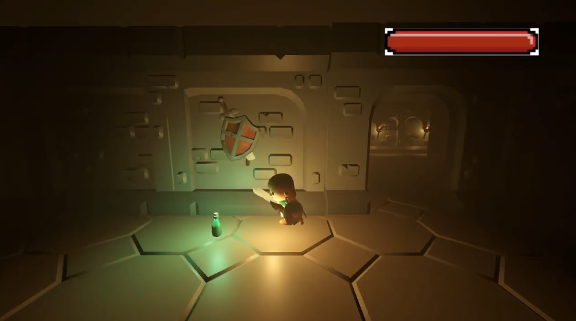
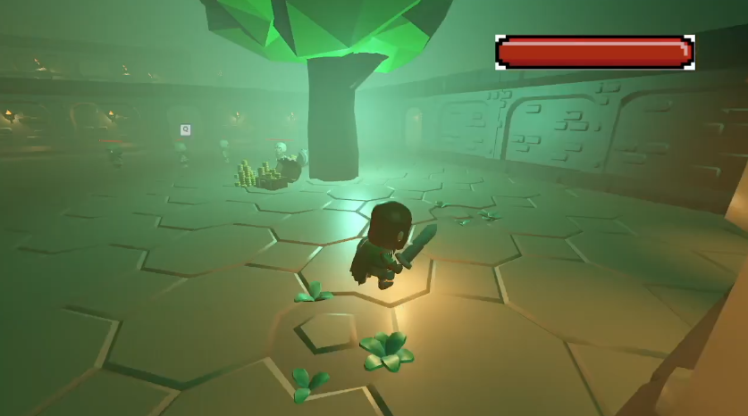
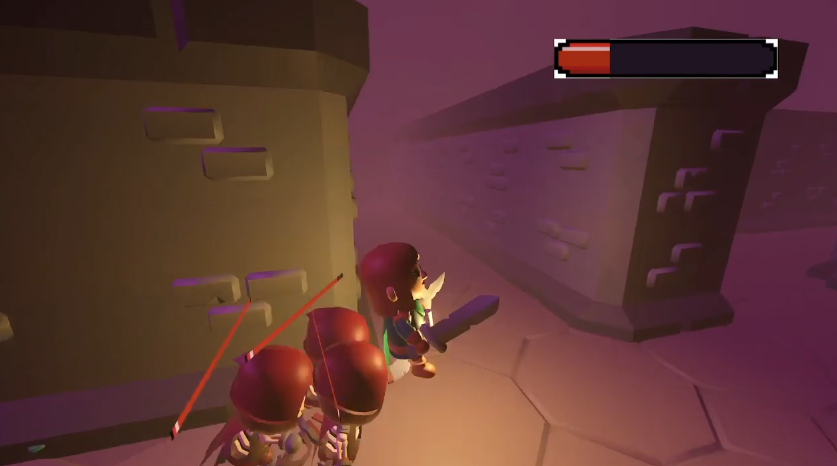

# Especificação da Implementação

> [!CAUTION]
> - Você <ins>**não pode utilizar ferramentas de IA para escrever esta
>   especificação**</ins>

> [!WARNING]
> - Após a entrega da primeira versão completa, esta especificação não
>   poderá ser alterada. A implementação final deverá corresponder ao que
>   estiver descrito neste arquivo.

## Integrantes da dupla

- **Aluno 1 - Nome**: Fábio Luiz da Costa Cieslak
- **Aluno 1 - Cartão UFRGS**: 00343799

- **Aluno 2 - Nome**: Leonardo Greco Fin
- **Aluno 2 - Cartão UFRGS**: 00595687

## Detalhes do que será implementado

- **Título do trabalho**: Masmorra Stealth 3D
- **Parágrafo curto descrevendo o que será implementado**: Jogo 3D de exploração e furtividade ambientado em uma masmorra. O jogador controla um personagem que precisa coletar chaves e tesouros e chegar à saída sem ser capturado por criaturas que patrulham o ambiente. As criaturas seguem rotas curvas (Bézier) e possuem um cone de visão; o jogador deve avançar apenas quando elas estiverem de costas, podendo se agachar para se esconder atrás de obstáculos. O jogo terá duas câmeras (3ª pessoa e mapa/top-down), HUD com minimapa, iluminação com tochas e colisões com raycast para a linha de visão.

## Especificação visual

### Vídeo - Link

> [!IMPORTANT]
> - Coloque aqui um link para um vídeo que mostre a aplicação gráfica
>   de referência que você vai implementar. **Sua implementação deverá
>   ser o mais parecido possível com o que é mostrado no vídeo (mais
>   detalhes abaixo).**
> - **Você não pode escolher como referência: (1) algum trabalho realizado
>   por outros alunos desta disciplina, em semestres anteriores. (2) Minecraft.**
> - Por exemplo, você pode colocar um vídeo de um jogo que você gosta,
>   e seu trabalho final será uma re-implementação do jogo.
> - O vídeo pode ser um link para YouTube, Google Drive, ou arquivo mp4 dentro
>   do próprio repositório. Mas, garanta que qualquer um tenha
>   permissão de acesso ao vídeo através deste link.

https://www.youtube.com/watch?v=DxGLiOMpHFA

### Vídeo - Timestamp

> [!IMPORTANT]
> - Coloque aqui um **intervalo de ~30 segundos** do vídeo acima, que
>   será a base de comparação para avaliar se o seu trabalho final
>   conseguiu ou não reproduzir a referência.

- **Timestamp inicial**: 0:45
- **Timestamp final**: 1:15

### Imagens

> [!IMPORTANT]
> - Coloque aqui **três imagens** capturadas do vídeo acima, que você
>   irá usar como ilustração para as explicações que vêm abaixo.
> - As imagens devem estar armazenadas neste repositório, no diretório
>   `images/spec/`, com os nomes `image1`, `image2` e `image3`.
> - Cada imagem deve usar o formato `.jpg` ou `.png`. Ajuste a extensão
>   nos vínculos abaixo para que corresponda ao arquivo armazenado.
> - Escolha imagens que correspondam a momentos do intervalo indicado
>   acima ou que sejam relevantes para a comparação com a implementação.

#### Imagem 1

- **Descrição**: Visão em 3ª pessoa do personagem explorando um corredor da masmorra, com tochas nas paredes e itens coletáveis no chão.

#### Imagem 2

- **Descrição**: Sala da masmorra com iluminação esverdeada, mostrando o layout do cenário, obstáculos, baús e as criaturas que patrulham o ambiente.

#### Imagem 3

- **Descrição**: Momento de exploração em que o personagem percorre a masmorra, ilustrando a perspectiva da câmera e o estilo visual low-poly que será replicado no trabalho.

## Especificação textual

Para cada um dos requisitos abaixo (detalhados no [Enunciado do Trabalho final - Moodle](https://moodle.ufrgs.br/mod/assign/view.php?id=6302370)), escreva um parágrafo **curto** explicando como este requisito será atendido, apontando itens específicos do vídeo/imagens que você incluiu acima que atendem estes requisitos.

### Malhas poligonais complexas
Serão utilizados modelos do pacote KayKit Dungeon Remastered (paredes modulares, chão, baús, tochas) e personagens low-poly (ladrão e esqueletos), todos formados por malhas de triângulos com texturas.

### Transformações geométricas controladas pelo usuário
O jogador poderá mover e rotacionar o personagem pelo cenário (WASD + mouse), além de agachar para se esconder e interagir com baús usando a tecla E. As transformações serão aplicadas via Model matrix calculada manualmente.

### Diferentes tipos de câmeras
Serão implementadas duas câmeras distintas: uma câmera em 3ª pessoa que segue o personagem (look-at) e uma câmera de mapa/top-down (tecla M) que mostra a masmorra de cima, útil para planejar a rota.

### Instâncias de objetos
Tochas, baús, moedas e paredes serão desenhadas várias vezes usando a mesma malha, variando apenas a Model matrix. Isso reduz o custo de memória e demonstra o conceito de instanciamento.

### Testes de intersecção
As colisões serão implementadas em collisions.cpp e incluirão: colisão jogador vs parede (AABB), colisão jogador vs baú, colisão jogador vs esqueleto e raycast do olhar do esqueleto até o jogador para verificar se há linha de visão (bloqueada por paredes).

### Modelos de Iluminação em todos os objetos
Será utilizado o modelo de Phong com iluminação ambiente baixa e múltiplas luzes pontuais representando as tochas da masmorra. O cajado mágico final também emitirá uma luz intensa. Todos os objetos terão iluminação aplicada.

### Mapeamento de texturas em todos os objetos
Todos os objetos terão texturas de imagem (pedra, madeira, metal) provenientes dos pacotes CC0 utilizados, além de possíveis texturas procedurais para detalhes.

### Movimentação com curva Bézier cúbica
Os esqueletos seguirão rotas de patrulha definidas por curvas de Bézier cúbicas fechadas, garantindo movimento suave e curvo pelo cenário.

### Animações baseadas no tempo ($\Delta t$)
Toda movimentação (personagem, esqueletos, espectro e rotação das tochas) será multiplicada por $\Delta t$ para garantir velocidade constante independente do FPS.

### Funcionalidade extra obrigatória

> [!IMPORTANT]
> - Descreva a funcionalidade extra relacionada à Computação Gráfica
>   que será implementada.
> - Esta funcionalidade também deverá ser documentada no arquivo
>   `README.md` da entrega final.

Será implementado um HUD completo com minimapa e indicador de visibilidade (olho que abre/fecha conforme o jogador está exposto ou escondido). Também haverá partículas de poeira ao andar e um efeito de transparência (alpha blending) no espectro que ressuscita os esqueletos.

## Limitações esperadas

> [!IMPORTANT]
> - Coloque aqui uma lista de detalhes visuais ou de interação que
>   aparecem no vídeo e/ou imagens acima, mas que você **não pretende
>   implementar** ou que você **irá implementar parcialmente**.
> - Para cada item, **explique por que** não será implementado ou por
>   que será implementado parcialmente.

- **Combate complexo:** Embora o vídeo de referência mostre combate com espadas e escudos, nossa implementação não contará com um sistema de combate corpo a corpo. O foco será a furtividade. A única forma de interação ofensiva será o uso de itens luminosos encontrados em baús, que derrotam os esqueletos temporariamente.
- **Barra de vida (HUD):** Embora as imagens de referência mostrem uma barra de vida, nossa implementação não contará com esse elemento. O HUD será composto apenas pelo contador de chaves/tesouros e pelo minimapa.
- **Diálogos e cutscenes:** O vídeo de referência contém cenas de diálogo. Nossa implementação não contará com sistema de diálogos ou cutscenes, pois o foco é a jogabilidade de furtividade em tempo real.
- **Animações complexas:** Não usaremos animações esqueléticas complexas; os personagens se moverão pelo cenário com o modelo inteiro. Isso simplifica a implementação e mantém o foco nos requisitos gráficos.
- **Som:** Não haverá sistema de som, pois não é exigido pela disciplina.
